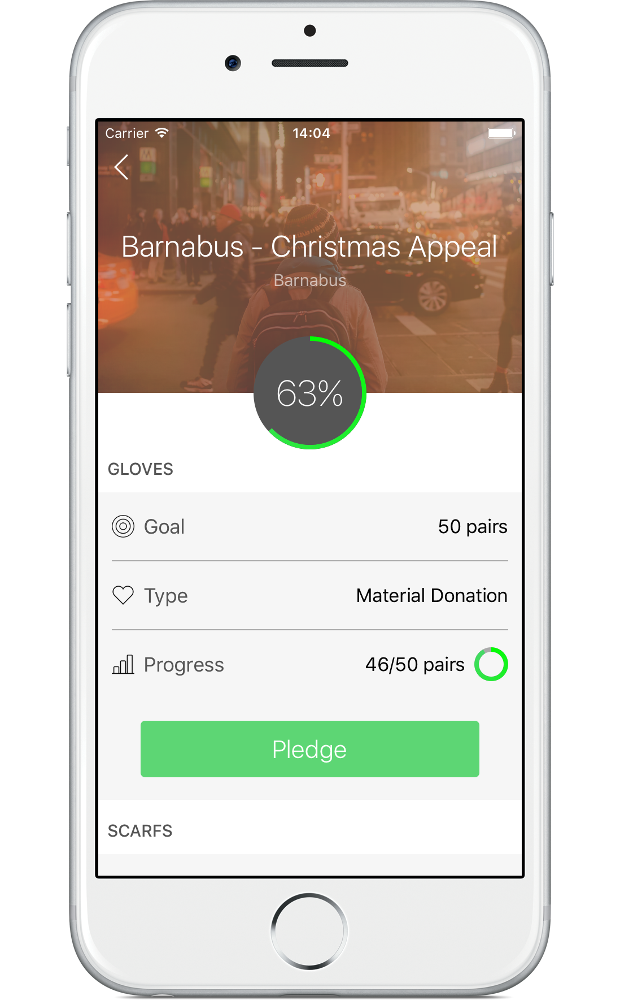

# Business Rocks 2016 Hackathon Entry

### About BR2016 Hackathon
How can technology help solve world homelessness? [Details](http://www.business-rocks.com/hackathon.html)

## Pledji

 

### Concept
Pledji is a crowd-source based solution for correcting the imbalance of supply and demand that all homeless-centric charities face. Using Pledji; charities are able to create effective donation campaigns, whether it be for material, services or finance. Pledji users are then able to pledge whatever they can to help the cause.

The full pitch keynote is available here: [Keynote](https://github.com/MerrickSapsford/BR2016-Hack/blob/develop/Keynote.key)

### Prototype
This repository contains the prototype iOS client. The code is in no way production ready, and there are some not so nice parts.

Simple clone, build and run the workspace. Built for iOS 9.

### Team
Gary Butcher, Tengiz Meskhi, Merrick Sapsford

Software Engineers @ [Apadmi](http://www.apadmi.com)

